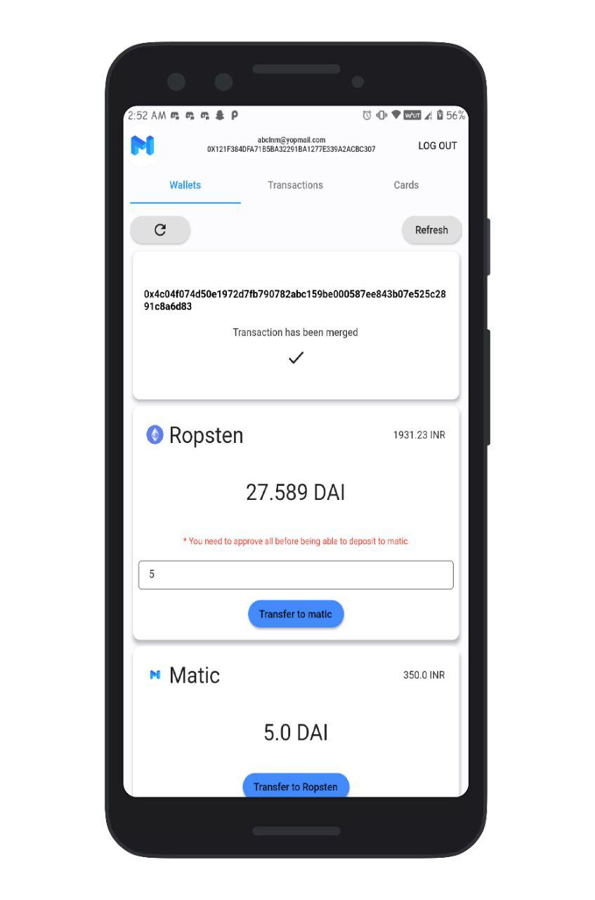
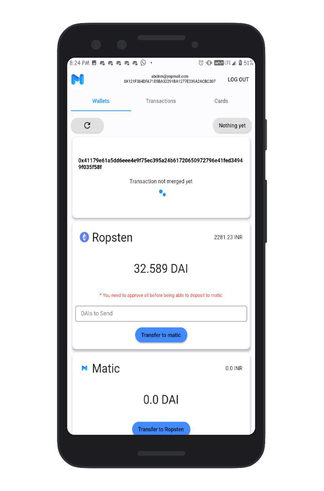
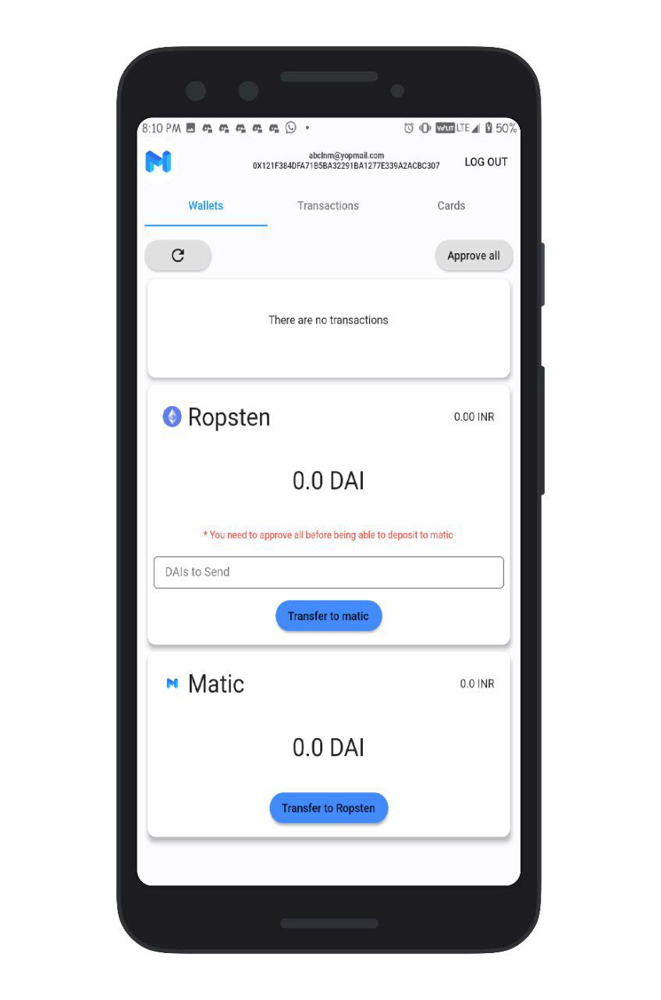
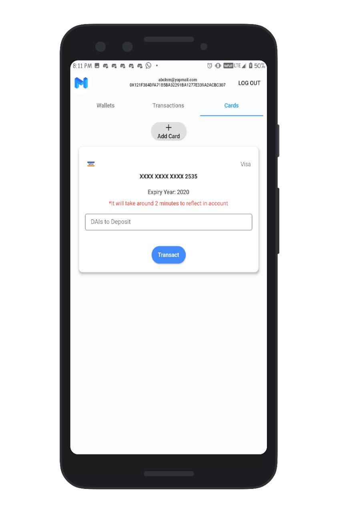
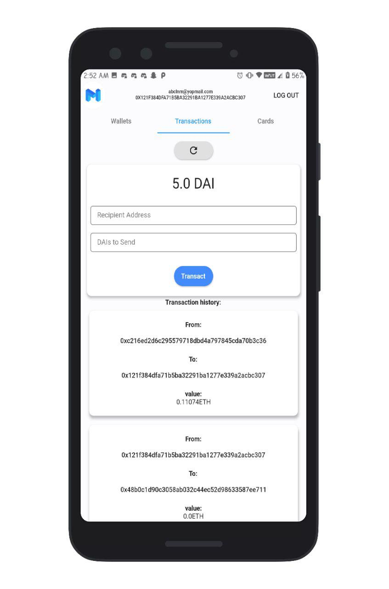
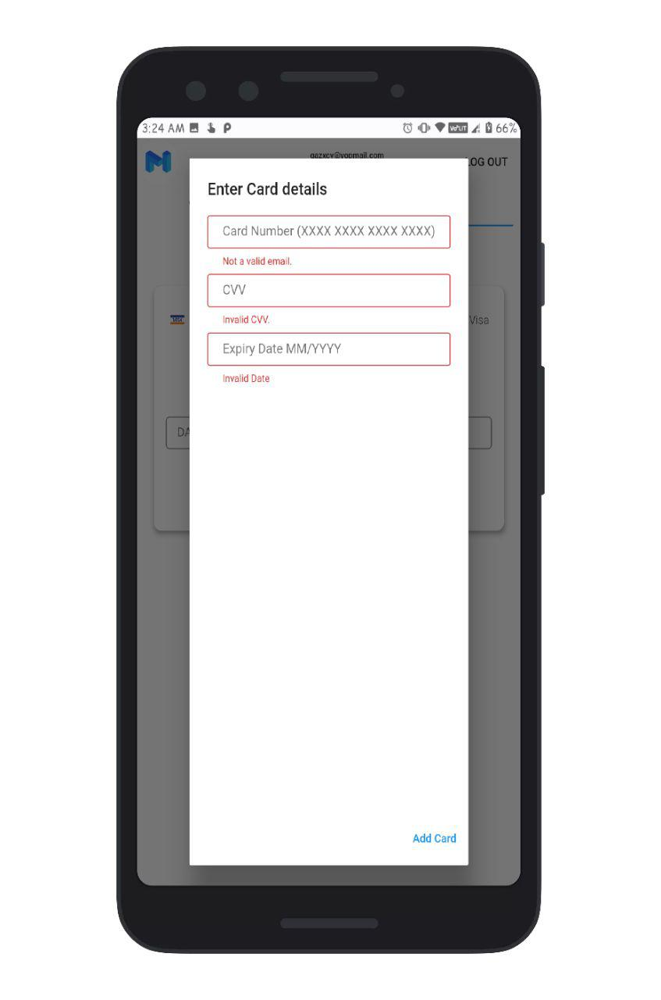
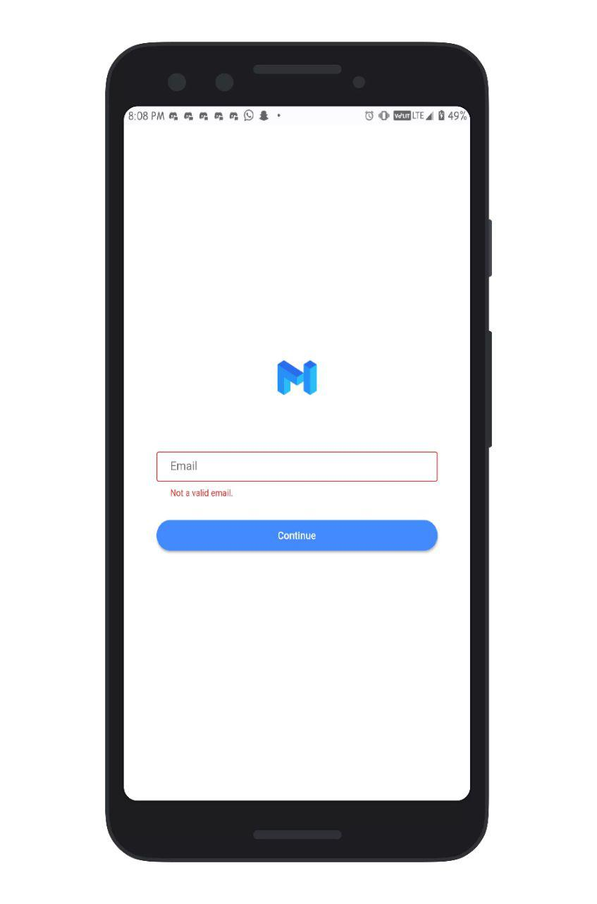
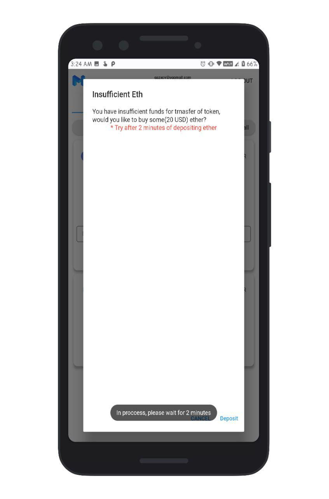

# Matic Wallet
 
**Check Releases for apk.** 
[Releases](https://github.com/Abhimanyu121/Matic-Wallet/releases/tag/Alpha-2)
## Aim
Matic Wallet Aims to make transactions of crypto currencies(Currently Moon Token) Faster and cost effective by utilizing the enormous potential of Matic's Plasma chain.
## Achievements
This application has won matic bounty of 2000USD in gitcoin Grow Ethereal hackathon.
## Description
Matic Wallet in testing phase has three layers of technology,
1. Moonpay - It proivdes easy and efficient fiat to Crypto Interface
2. Ropsten - Ropsten acts as intermediate layer between Moonpay and Matic chain
3. Matic Network - It allows Users to send their crpyto tokens with astounding speed and least transaction fee.
On combining all three of these it provides an efficient solution for the primary drawbacks of the Ethereum chain.
## Current Progress
- [x] Moonpay Fiat to crypto Interface.
- [x] Transfer of tokens from one address to another on matic network.
- [x] Depositing Moon Tokens(approve, allowance and deposit) to Matic network.
- [x] Checking status of transactions uisng etherscan.
- [x] Checking Transaction history on matic network
- [x] Native platform channel for Foreground services.
- [x] Web3J dependencies to for interacting with contract from foreground services
- [ ] Withdrawl of Tokens from matic to Ropsten(WIP).
- [ ] Moving heavy and time consuming transactions to background service.
## How to use
1. Login with your email.
2. Upload a Selfie of you along with ID card(In test phase uploading any photo will work).
3. Enter Details of your Debit/ Credit Cards(Currently Test cards are hard coded so enter anything random).
4. Generate a new account or enter private key(generate new account for testing, instead of using primary account).
5. Go to cards section and add some tokens to your wallet(Check email for transaction hash, and check it on ropsten etherscan).
5. In wallets tab, tap on  approve all and refresh in a while(till transaction gets merged).
6. If prompt comes up saying insufficient ether, tap on add ether and check transaction status from link on mail and once ether is added click on approve all again..
6. Then tap on allow all button to allow matic contract to spend dai(Moon tokens).
7. You can tap on transaction hash to copy it and check it on etherscan or click on right refresh button to check status.
8. Once transaction is merged, deposit tokend to matic chain.
9. If transaction fails, top button will change to "allow increase" to allow user to increase spending limit for root chain contract.
10. Transact the tokens over matic network as much as you like with its low cost and fast transactions.
11. You can copy  addresses and transaction hash by taping on them.
#### Note 1: It has a lot of jagged edge, in case it behaves abnomally, ping me on Telegram @abhimanyu121.
#### Note 2: Please enter correct inputs, exceptional handling is not properly implmented yet.
#### Note 3: Withdraw of tokens from matic network is not available as of now due to limited time.
#### Note 4: Follow exact sequence of instructions.
## Screenshots
||
||
||
||
## Tech stack Used
1. Flutter
2. Web3Dart
3. Moonpay Rest Interface
4. Matic Plasma Chain
5. Ropsten test Chain

## 🔖 LICENCE
[WTFPL](http://www.wtfpl.net/about/)
